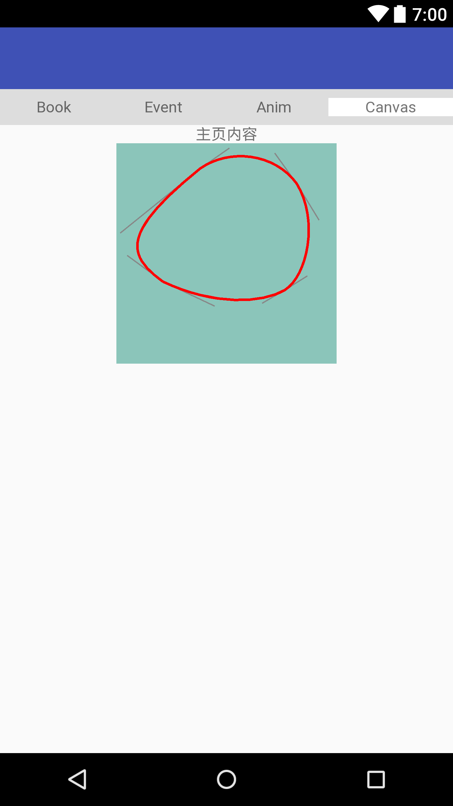

# 塞尔曲线绘制Photoshop钢笔矢量图


### 贝塞尔曲线

贝塞尔曲线的主要优点是可以实时控制曲线状态，并可以通过改变控制点的状态实时让曲线进行平滑的状态变化。比如非棱角（圆角）曲线图。


对于高阶的曲线，用低阶的曲线组合也可达到相同的效果，即降阶。

贝塞尔曲线 | 对应的方法 | 演示动画
---|---|---
一阶贝塞尔曲线（直线） | ```path.lineTo(end.x, end.y)``` | 
二阶贝塞尔曲线（抛物线） | ```path.cubicTo(control1.x, control1.y, control2.x,control2.y, end.x, end.y);``` | 
三阶贝塞尔曲线 | ```Path.cubicTo(float x1, float y1, float x2, float y2, float x3, float y3)``` | 


### 使用方法

```
@Override
protected void onDraw(Canvas canvas) {
    super.onDraw(canvas);

    // P1-->P2
    // 初始化
    start.x = 266;
    start.y = 80;
    end.x = 573;
    end.y = 128;
    control1.x = 359;
    control1.y = 15;
    control2.x = 503;
    control2.y = 31;
        
    path.moveTo(start.x, start.y); // 起点
    path.cubicTo(control1.x, control1.y, control2.x,control2.y, end.x, end.y); // 三阶贝塞尔曲线

    canvas.drawPath(path, paint);
}

```

### 一个栗子

下图使用Photoshop钢笔工具绘制，其中图片大小为761*544px。


绘制点P1到P2，其控制点分别为C11、C21，其各自坐标如图所示。
同理，其他绘制点P2-->P3、P3-->P4、P4-->P1，对应的控制点具体看图所示。

补充：如何从Potoshop图上得到各具体点坐标？

首先，窗口---信息（快捷键F8），打开信息窗口，然后使用鼠标移动到各点即可看到具体坐标。

另外，信息窗口默认显示的坐标是毫米，需要从信息窗口右边小三角点击，然后弹出的面板选择--面板选项，在鼠标坐标栏目选择"像素"。


```
@Override
protected void onDraw(Canvas canvas) {
    super.onDraw(canvas);

    // P1-->P2
    // 初始化
    start.x = 266;
    start.y = 80;
    end.x = 573;
    end.y = 128;
    control1.x = 359;
    control1.y = 15;
    control2.x = 503;
    control2.y = 31;
        
    path.moveTo(start.x, start.y); // 起点
    path.cubicTo(control1.x, control1.y, control2.x,control2.y, end.x, end.y); // 三阶贝塞尔曲线

    canvas.drawPath(path, paint);
}

```

最后结果：

