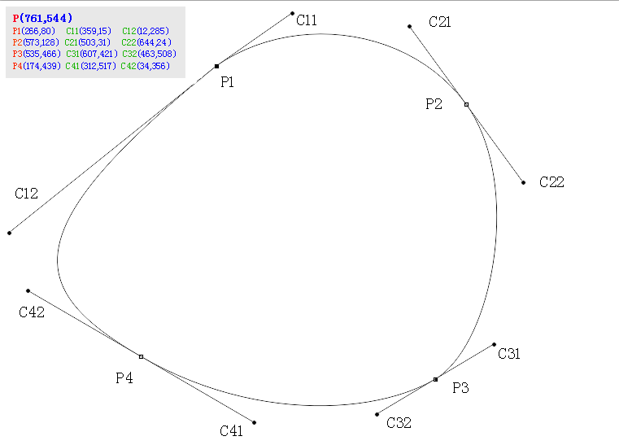

# Photoshop矢量图转Android自定义View


### 贝塞尔曲线

贝塞尔曲线(Bézier curve)，又称贝兹曲线或贝济埃曲线，是应用于二维图形应用程序的数学曲线。一般的矢量图形软件通过它来精确画出曲线，我们在绘图工具上看到的[钢笔工具](http://bezier.method.ac/)就是来做这种矢量曲线的。


Android从API1起就支持贝塞尔曲线，实现方式是借助android.graphics.Path类。

一般来说，开发者只考虑二阶贝塞尔曲线和三阶贝塞尔曲线，对于再高阶的贝塞尔曲线，通常可以将曲线拆分成多个低阶的贝塞尔曲线，也就是所谓的降阶操作。


贝塞尔曲线 | 对应的方法 | 演示动画
---|---|---
一阶贝塞尔曲线（直线） | ```path.lineTo(end.x, end.y)``` | 
二阶贝塞尔曲线（抛物线） | ```path.cubicTo(control.x, control.y, end.x, end.y)``` | 
三阶贝塞尔曲线 | ```path.cubicTo(control1.x, control1.y, control2.x,control2.y, end.x, end.y)``` | 


### 使用方法

```
@Override
protected void onDraw(Canvas canvas) {
    super.onDraw(canvas);

    // P1-->P2
    // 初始化
    start.x = 266;
    start.y = 80;
    end.x = 573;
    end.y = 128;
    control1.x = 359;
    control1.y = 15;
    control2.x = 503;
    control2.y = 31;
        
    path.moveTo(start.x, start.y); // 起点
    path.cubicTo(control1.x, control1.y, control2.x,control2.y, end.x, end.y); // 三阶贝塞尔曲线

    canvas.drawPath(path, paint);
}

```

### 一个栗子

下图使用Photoshop钢笔工具绘制，其中图片大小为761*544px。




*数据点*P1到P2，其*控制点*分别为C11、C21，其各自坐标如图所示。

其它数据点P2-->P3、P3-->P4、P4-->P1，对应的控制点分别为C22和C31、C32和C41、C42和C12。


Ps：如何从Potoshop图获取各点坐标？

首先，窗口--信息（快捷键F8），打开信息窗口，然后使用鼠标移动到各点即可看到具体坐标。

另外，信息窗口默认显示的坐标是毫米，需要从信息窗口右边小三角点击，然后弹出的面板选择--面板选项，在鼠标坐标栏目选择"像素"。


```
@Override
protected void onDraw(Canvas canvas) {
    super.onDraw(canvas);

    // P1-->P2
    // 初始化
    start.x = 266;
    start.y = 80;
    end.x = 573;
    end.y = 128;
    control1.x = 359;
    control1.y = 15;
    control2.x = 503;
    control2.y = 31;
        
    path.moveTo(start.x, start.y); // 起点
    path.cubicTo(control1.x, control1.y, control2.x,control2.y, end.x, end.y); // 三阶贝塞尔曲线

    canvas.drawPath(path, paint);
}

```

最后结果：


### 参考资料
- [贝塞尔曲线原理介绍及基础使用
](http://double0291.github.io/2015/10/09/bezierBase/) （```腾讯聊天界面实现，注意：由于原图比较大，代码绘制过程中，坐标根据设计图中的坐标乘以了3```）
- [eclipse_xu - 贝塞尔曲线开发的艺术](http://blog.csdn.net/eclipsexys/article/details/51956908)（```Android群英传作者，贝塞尔曲线在线工具+曲线图变圆应用```）
- [德卡斯特里奥算法——找到Bezier曲线上的一个点](http://blog.csdn.net/venshine/article/details/51750906)
-  通过 de Casteljau 算法绘制贝塞尔曲线，并计算它的切线，实现 1-7 阶贝塞尔曲线的形成动画。 http://blog.csdn.net/u014608640/article/details/53063800
- [android 贝塞尔曲线的应用](http://www.jianshu.com/p/c0d7ad796cee)